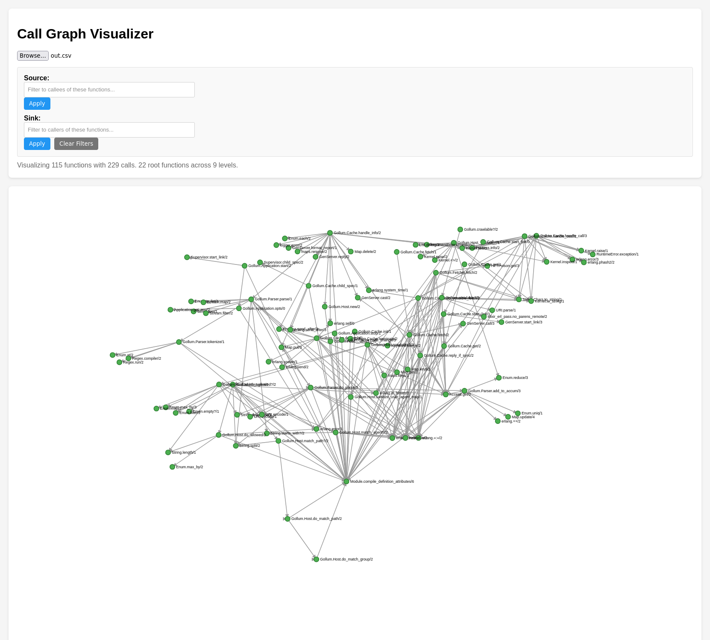

# Grapher



The goal of this project is to visualize call graphs.  From CSVs whose format is:
```
source,target
"foo","bar"
```
The first line is headers, the second line indicates that `foo` calls `bar`.

A live version may be used at https://j3rn.com/grapher
